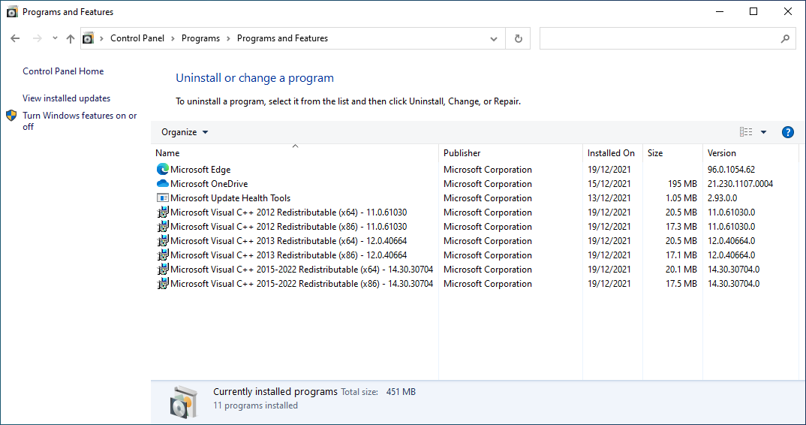

# Quick install

The VcRedist module's primary usage is in enterprise operating system deployment for 100's or 1,000's of Windows PCs; however, it can be used to quickly install the support Visual C++ Redistributables on your current system.

## Install the Visual C++ Redistributables

1. First, ensure that you are using a PowerShell as an administrator. Find PowerShell in the Start menu, right-click on the shortcut and choose `Run as Administrator`
2. Install with PowerShell

!!! tip

    Please inspect [https://vcredist.com/install.ps1](https://vcredist.com/install.ps1) prior to running the following command to ensure safety. We already know the script is safe, but you should verify the security and contents of any script from the internet you are not familiar with. The command below downloads a remote PowerShell script and executes it on your machine.

Now copy the following command:

```powershell
Set-ExecutionPolicy Bypass -Scope Process -Force; [System.Net.ServicePointManager]::SecurityProtocol = [System.Net.ServicePointManager]::SecurityProtocol -bor 3072; iex ((New-Object System.Net.WebClient).DownloadString('https://vcredist.com/install.ps1'))
```

3. Paste the code into the PowerShell prompt that you have chosen to run as administrator
4. Wait a few seconds for the command to run. If the script does not produce any errors, then the latest Visual C++ Redistributables should be installed.

You should see output similar to the following:

```powershell
Checking whether module is installed: VcRedist.
Installing module: VcRedist 3.0.307.
Saving VcRedists to path: C:\Users\aaron\AppData\Local\Temp\VcRedist.
Downloading supported Microsoft Visual C++ Redistributables.
Installing supported Microsoft Visual C++ Redistributables.
Install complete.
Installed Visual C++ Redistributables:

Name                                                               Release Architecture Version
----                                                               ------- ------------ -------
Microsoft Visual C++ 2012 Redistributable (x64) - 11.0.61030       2012    x64          11.0.61030.0
Microsoft Visual C++ 2012 Redistributable (x86) - 11.0.61030       2012    x86          11.0.61030.0
Microsoft Visual C++ 2013 Redistributable (x64) - 12.0.40664       2013    x64          12.0.40664.0
Microsoft Visual C++ 2013 Redistributable (x86) - 12.0.40664       2013    x86          12.0.40664.0
Microsoft Visual C++ 2015-2022 Redistributable (x64) - 14.30.30704 2022    x64          14.30.30704.0
Microsoft Visual C++ 2015-2022 Redistributable (x86) - 14.30.30704 2022    x86          14.30.30704.0
```

Once the command is complete, you should see the Visual C++ Redistributables installed on your local system, looking similar to this:


